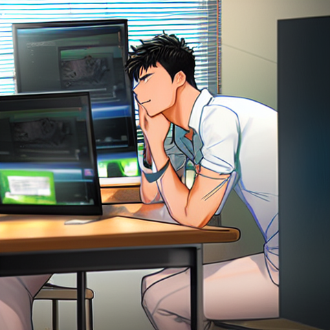

# 비대면 수업 줌 헬퍼
해당 프로그램은 비대면 줌 수업 시
쉬는 시간마다 지루하게 반복 작업을 해야하는 부분을
자동화 처리를 하기위해 제작하였습니다.

## 만들게 된 계기
한 시간 중 50분부터 10분 간 휴식시간이다.

휴식 시간 10분 기간마다 시작과 종료일 때
비디오 캠을 ON/OFF 하여야 한다.

그러나 나는 귀찮다. ON/OFF 를 매번 클릭하기

그렇다고 안끄고 가만히 있으면 나를 빼고 전원 모두가 비디오 캠을 끄기때문에
나만 전체 얼굴이 공개된다.

나는 극심한 I 라 매우 이것이 부끄럽다.

그래서 자동화 하였음.

## 동작 흐름
* 50분이 되면 자동으로 캠 OFF
* 00분이 되면 자동으로 캠 ON

> 캠 ON/OFF 는 해당 MM분에 랜덤한 SS 로 동작(0~30 랜덤)
